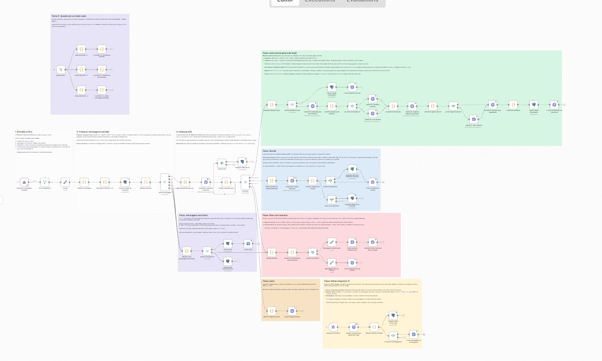

# Bot Fale Bem: atendimento no WhatsApp com n8n

Bot de triagem da Escola Fale Bem, feito para o desafio técnico da The Growth Hub. A mensagem chega do Chatwoot, a IA identifica a intenção, o bot responde dúvidas só com os dados oficiais, captura leads no Pipedrive e passa a conversa para uma atendente quando faz sentido.

| Item | Escolha |
|---|---|
| n8n | 1.123.83, self-hosted via Docker Compose |
| Banco | PostgreSQL 16: banco `n8n` para o n8n e `falebem` para o bot |
| IA | OpenAI `gpt-4.1-nano` com JSON schema estrito |
| CRM | Pipedrive, conta trial real, API v2 |
| Chatwoot | simulado no webhook.site |

---

## Como rodar

Pré-requisito: Docker Desktop.

```bash
cp .env.example .env      # troque POSTGRES_PASSWORD e N8N_ENCRYPTION_KEY
docker compose up -d      # na 1ª subida, db/init/01-falebem.sql cria o banco do bot
# abra http://localhost:5678 e crie a conta de dono
```

**Credenciais.** O JSON do workflow só referencia as credenciais, sem nenhum segredo:

| Credencial | Tipo | Preenchimento |
|---|---|---|
| OpenAI | OpenAi | API key |
| Pipedrive | Pipedrive API | API token |
| Postgres - falebem | Postgres | Host `postgres`, DB `falebem`, usuário e senha do `.env` |
| Chatwoot | Header Auth | `api_access_token` = token de teste |
| n8n API | Header Auth | `X-N8N-API-KEY` = chave criada em Settings → n8n API |

**Importar:** Import from File → `workflows/bot-fale-bem.json`, selecionar as credenciais nos nós, ajustar `chatwoot_url` e `openai_model` no nó **Config** e ativar. O Chatwoot chama `POST {n8n}/webhook/chatwoot-falebem` no `message_created`.

> A documentação fica dentro do workflow: uma nota colorida por faixa, uma nota curta embaixo de cada nó e comentários no código de cada Code node.

---

## Como o workflow funciona

O canvas é dividido em faixas, cada uma com uma nota colorida explicando a lógica:



```
PRINCIPAL   Webhook → Deve responder? → Config → Normalizar telefone (2.1) → Buscar estado
            → Tipo de mensagem ─┬─ texto → IA classifica → Validar → Intenção
                                └─ sem texto → faixa "sem texto"
DÚVIDA      IA responde só com os dados oficiais → trava anti-invenção → envia
MATRÍCULA   pergunta o que falta | Pipedrive (pessoa sem duplicar → negócio) → etiqueta → confirma
HUMANO      feriados → dentro do horário? → transfere para a equipe | informa quando a equipe volta
OUTRO       lembra o dado pendente ou apresenta o menu
SEM TEXTO   aviso → oferta de atendente → transferência
FALHAS      Error Trigger → lê a execução que falhou → error_log + contingência + alerta à equipe
PARTE 2     os três exercícios, com Manual Trigger próprio
```

| # | Requisito | Onde |
|---|---|---|
| 1 | Webhook `message_created` | **Chatwoot: mensagem recebida**, com o payload do PDF como pin data |
| 2 | Só contato; silêncio com atendente | **Deve responder?**: `incoming`, não privada, `sender.type = contact`, `pending`, sem `assignee` |
| 3 | 4 intenções, saída estruturada, falha → `outro` | JSON schema com `enum` → **Validar resposta da IA** |
| 4 | Dúvidas só com os dados do cenário | Faixa dúvida + trava anti-invenção |
| 5 | Lead no Pipedrive sem duplicar + etiqueta | Faixa matrícula |
| 6 | Transferência pelo horário de Recife | Faixa humano, com feriados |
| 7 | Contingência + registro de falhas | Faixa falhas + log das falhas da OpenAI |
| 8 | Legibilidade, sem credenciais | Nomes descritivos, nota por faixa, credenciais por referência |

---

## Onde fica o estado da conversa e por quê

Tabela `conversation_state` do banco `falebem`, uma linha por conversa: etapa `inicio` → `coletando` → `concluido`, nome, e-mail, curso, o campo que o bot perguntou por último e os contadores do escalonamento. Esquema em `db/init/01-falebem.sql`.

- **Cada mensagem é uma execução nova**, então o estado precisa ficar fora do n8n.
- **Já está na stack**: o n8n self-hosted usa Postgres, sem serviço novo.
- **Consultável** em SQL, junto do `error_log`.
- **Upsert** com `ON CONFLICT DO UPDATE`: repetir não duplica. O estado é salvo *antes* de enviar a pergunta, para o bot não perguntar algo cuja resposta vai esquecer.

Alternativas consideradas:
- *static data* do n8n: não aguenta execuções simultâneas;
- `custom_attributes` do Chatwoot: boa opção com Chatwoot real, mas aqui ele é simulado;
- Redis: seria mais um serviço para operar.

---

## Decisões que valem explicar

- **IA pequena + redes de segurança em código.** Curso e e-mail escritos na mensagem são extraídos por regex; resposta curta como "Mariana" no meio da matrícula continua sendo matrícula; "sim" logo após o bot oferecer atendente vira `falar_com_humano`. Esse último fica só no código: avisar a IA fez ela classificar até um e-mail como pedido de atendente.
- **Trava anti-invenção.** Todo `R$` e horário da resposta da IA é conferido contra os dados oficiais: 389, 349, 120, 8h e 18h. Se não bater, a resposta é descartada e o bot oferece uma atendente.
- **Só texto vai para a IA.** Figurinha, emoji solto, foto sem legenda e áudio sem transcrição recebem resposta fixa, o que economiza chamadas e ajuda contra o 429. Repetições escalam: aviso → oferta de atendente → transferência.
- **Pipedrive API v2**, porque a v1 de pessoas e negócios foi desligada em 31/07/2026. Pessoa: busca pelo telefone normalizado com o 2.1, atualiza ou cria. Negócio: não cria se já existe um aberto com o mesmo título. Valor = matrícula + mensalidade × duração: R$ 7.122 no Inglês e R$ 4.308 no Espanhol.
- **Etiqueta:** o `/labels` do Chatwoot substitui a lista, então o bot envia as antigas + `lead-qualificado`.
- **Horário:** regra do 2.2 + feriados nacionais, de PE e de Recife de 2026 e 2027. Fora do horário, informa a próxima abertura pulando fim de semana e feriado. O servidor, o n8n e o Postgres ficam em UTC; a conversão para `America/Recife` é feita só no código, com `Intl`.
- **Todo Switch tem fallback.** Intenção desconhecida vai para `outro`, tipo desconhecido vai para a faixa sem texto, e um passo de lead desconhecido vira erro, que cai na faixa de falhas. Nenhuma mensagem fica sem caminho.
- **Falhas num Error Trigger**, em vez de dezenas de linhas de erro cruzando o canvas. Qualquer nó que falhe dispara a faixa de falhas, que lê a execução pela API do n8n, o que funciona mesmo com o banco do bot fora, grava em `error_log` e envia a contingência. A OpenAI é tratada no próprio fluxo, porque o bot segue sem ela e responde como `outro`. Só dispara com o workflow ativo.
- **Alerta para a equipe.** Toda falha, da IA ou da faixa de falhas, deixa uma **nota privada** na conversa do Chatwoot (`/messages` com `private: true`): a atendente vê o erro na própria conversa e pode assumir; o contato não vê. Não precisa de serviço novo, e o filtro de entrada ignora mensagens privadas, então não há loop.

```sql
SELECT created_at, node, message, conversation_id FROM error_log ORDER BY created_at DESC;
```

---

## Chamadas ao Chatwoot e ao Pipedrive

Chatwoot, com o header `api_access_token`, numa matrícula concluída:

```http
POST /api/v1/accounts/3/conversations/42/messages
{"content": "Prontinho, Mariana! Sua pré-matrícula no curso de Inglês foi registrada. ...", "message_type": "outgoing", "private": false}

POST /api/v1/accounts/3/conversations/42/labels
{"labels": ["lead-qualificado"]}
```

Transferência dentro do horário:

```http
POST /api/v1/accounts/3/conversations/42/toggle_status
{"status": "open"}
```

Pipedrive, numa conta trial real:

```http
GET   /api/v2/persons/search?term=98765432&fields=phone
PATCH /api/v2/persons/9     {"name": "Mariana Souza", "emails": [...], "phones": [{"value": "+5581998765432", ...}]}
GET   /api/v2/deals?person_id=9&status=open
POST  /api/v2/deals         {"title": "Matrícula Inglês", "person_id": 9, "value": 7122, "currency": "BRL"}
```

### Prints

| Chamada | Print |
|---|---|
| `/messages`: dúvida de preço, R$ 389 | [01](docs/prints/01-duvida-preco.png) |
| `/messages`: pergunta sobre francês, fora dos dados → oferece atendente | [02](docs/prints/02-duvida-sem-resposta.png) |
| `/messages`: coleta da matrícula, "Qual é o seu e-mail?" | [03](docs/prints/03-matricula-pergunta.png) |
| `/messages`: matrícula confirmada | [04](docs/prints/04-matricula-confirmada.png) |
| `/labels`: `lead-qualificado` | [05](docs/prints/05-etiqueta.png) |
| `/messages`: transferência dentro do horário | [06](docs/prints/06-transferencia-mensagem.jpeg) |
| `/toggle_status`: `open` | [07](docs/prints/07-transferencia-status.png) |
| `/messages`: fora do horário, com a próxima abertura pulando o feriado | [08](docs/prints/08-fora-do-horario.png) |
| `/messages`: contingência com o banco fora do ar | [09](docs/prints/09-contingencia.png) |
| Pipedrive: pessoa com telefone normalizado | [10](docs/prints/10-pipedrive-pessoa.png) |
| Pipedrive: negócio "Matrícula Inglês", R$ 7.122 | [11](docs/prints/11-pipedrive-negocio.png) |
| Canvas do n8n | [12](docs/prints/12-canvas.png) |

---

## Testes

`testes/` tem 17 mensagens no formato do Chatwoot; [`testes/ROTEIRO.md`](testes/ROTEIRO.md) diz a ordem e o resultado esperado. O roteiro foi executado com o workflow ativo, incluindo duas falhas provocadas: banco fora do ar, com contingência e registro no `error_log`, e OpenAI fora do ar, com resposta como `outro` e registro.

---

## Parte 2: Code nodes

Na faixa **Parte 2** do workflow, com o próprio Manual Trigger (*Test workflow → Testar Parte 2*). JavaScript puro, passa nos casos do PDF e em casos de borda.

| Exercício | Observações |
|---|---|
| 2.1 Normalizar telefone | Valida o DDD pela lista da Anatel e o 9 do celular; só remove o `55` quando o tamanho bate, já que 55 também é DDD. Usado no bot. |
| 2.2 Horário de atendimento | `Intl.DateTimeFormat` com `America/Recife`, sem somar offset na mão. Data inválida → `false`. |
| 2.3 Juntar mensagens picadas | Agrupa por conversa, ordena por `created_at`, desempatando pela ordem de chegada, e devolve `[{ json }]`. |

**Como esperar as mensagens picadas:** cada mensagem vai para um buffer por conversa e a execução espera ~8 s num nó Wait. Se nesse tempo chegou outra mensagem da mesma conversa, encerra sem responder, porque a execução mais nova responde; se não, junta o buffer com o 2.3 e manda para a IA como uma frase só.

---

## Parte 3: diagnóstico

**1. Bot responde a própria resposta em loop**
- Causa: o Chatwoot dispara `message_created` também para as mensagens enviadas pelo bot, as `outgoing`, e o fluxo não filtra o remetente.
- Confirmar: no n8n, execuções seguidas na mesma conversa com `message_type: outgoing`; no Chatwoot, mensagens do bot encadeadas sem cliente no meio.
- Correção: responder só a `incoming`, não privada, `sender.type = contact`. É o que faz o filtro *Deve responder?*.

**2. Mesmo contato três vezes no Pipedrive**
- Causa: o fluxo cria a pessoa sem buscar, ou busca pelo telefone cru ("(81) 99876-5432" ≠ "+5581998765432").
- Confirmar: no Pipedrive, mesmo número em formatos diferentes; no n8n, essas execuções sempre passam por "criar" e nunca por "atualizar".
- Correção: normalizar com o 2.1 antes de buscar e gravar, criar só se não achar, e juntar os duplicados com o *merge* do Pipedrive.

**3. Bot responde por cima da atendente**
- Causa: o filtro não olha `assignee` nem `status`, ou o bot não muda o status ao transferir.
- Confirmar: no n8n, execuções com `assignee` preenchido ou `status: open` que enviaram mensagem; no Chatwoot, mensagens do bot depois da atribuição.
- Correção: responder só com `pending` e sem `assignee`, e chamar `toggle_status → open` ao transferir. Este bot faz os dois.

**4. Erro 429 em dia de campanha**
- Causa: o pico estoura o limite de requisições, geralmente da OpenAI, e, sem nova tentativa, a execução morre sem responder.
- Confirmar: no n8n, erros 429 concentrados no horário da campanha, mostrando o nó e o `retry-after`; no painel do provedor, uso no limite.
- Correção: *Retry On Fail* com espera, menos chamadas, sem enviar mensagem sem texto para a IA e com *debounce*, limite de concorrência ou queue mode, e contingência + log para o que ainda falhar.

---

## O que ficou de fora

- **Chatwoot real:** basta trocar `config.chatwoot_url` e o token.
- **Alerta fora do Chatwoot:** se o próprio Chatwoot cair, a nota privada também não chega; fica o `error_log`. O próximo passo seria um e-mail ou Slack para a equipe.
- ***Debounce*:** o 2.3 está pronto e o desenho está acima, mas o bot responde mensagem a mensagem.
- **Whisper/OCR:** o bot usa a transcrição do Chatwoot quando existe.
- **"Esfriar" estado antigo:** uma matrícula parada há dias retoma de onde parou. A ideia é usar `updated_at` e a janela de 24h.
- **Chamar o contato de volta**, como "ficou faltando seu e-mail": exigiria agendador e template da Meta.
- **Feriados:** lista até 2027, precisa de revisão anual.
- **Testes automatizados** dos Code nodes: os casos foram rodados manualmente em Node.

---

## Estrutura do repositório

```
docker-compose.yml          n8n 1.123.83 + Postgres 16
.env.example                variáveis (o .env real não vai para o Git)
db/init/01-falebem.sql      banco do bot: conversation_state + error_log
workflows/bot-fale-bem.json workflow completo para importar (Parte 1, Parte 2 e falhas)
testes/                     mensagens de teste + ROTEIRO.md
docs/prints/                prints do webhook.site e do Pipedrive
```
